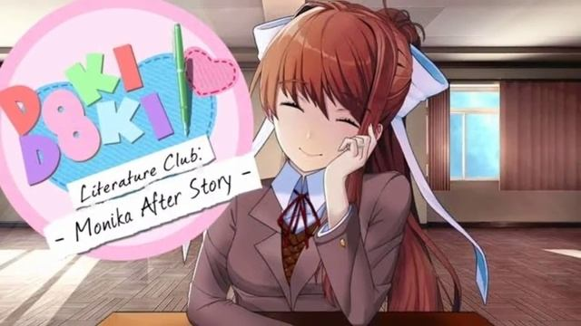

<div align="center">



# Моника: Эпилог

**Русский перевод и порт Monika After Story**  
*ветка `renpy-7-port` · MAS 0.12.18*

<br>

[](https://www.renpy.org/release/7.4.11)
[](#-android)
[](https://github.com/Monika-After-Story/MonikaModDev/releases)
[](#о-проекте)
[](#статус)
[](https://ddlc.moe)
[](https://github.com/artem213101zse/MonikaModDev-RU/discussions)

<br>

[Установка](#-установка) ·
[Android](#-android) ·
[Разработка](#-разработка) ·
[Помочь проекту](#-помочь-проекту) ·
[Оригинальный MAS](#моника-эпилог-mas)

</div>

---

## О проекте

Привет! Это форк [MonikaModDev](https://github.com/Monika-After-Story/MonikaModDev) с **русским переводом** и **портом на Android**.

Я видел классные мобильные порты MAS (The Encoders Club, Just6889 и др.), но они в основном на английском и испанском. Хотелось сделать **свой русскоязычный вариант** с удобством на телефоне — без заимствования чужих переводов, с нуля в скриптах.

**Как устроен перевод:** строки заменяются прямо в `.rpy` (без блоков `translate russian`) — так проще поддерживать порт и собирать APK.

| | |
|---|---|
| **Движок** | [Ren'Py 7.4.11](https://www.renpy.org/release/7.4.11) («Lucky Beckoning Cat») |
| **База мода** | Monika After Story **0.12.18** |
| **Ветка** | `renpy-7-port` |
| **Пакет Android** | `com.artemdev.mas` |

## Статус

| Направление | Состояние |
|-------------|-----------|
| Порт на Ren'Py 7.4 | В работе |
| Сборка Android | Работает (экспериментально) |
| Русский перевод | Начальная стадия (~5% и меньше) |
| Сортировка ассетов DDLC (`game/ddlc/`) | Отложено |

> Проект на энтузиазме — обновления не ежедневные. Можно **⭐ поставить звезду** репозиторию, чтобы следить за прогрессом.

---

## Установка

### Windows / Linux / macOS

1. Скачай **бесплатную** [Doki Doki Literature Club](https://ddlc.moe) (не Plus!).
2. Клонируй репозиторий:
   ```bash
   git clone https://github.com/artem213101zse/MonikaModDev-RU.git
   cd MonikaModDev-RU
   git checkout renpy-7-port
   ```
3. Скопируй содержимое папки `Monika After Story/` в каталог DDLC (рядом с `DDLC.exe`).
4. Запусти игру. Нужны файлы оригинала: `images.rpa`, `scripts.rpa`, `audio.rpa`, `fonts.rpa` в `game/` **или** распакованные ассеты (см. ветку / `game/ddlc/`).

### Android

Сборка через Ren'Py Launcher с установленным **RAPT** для [7.4.11](https://www.renpy.org/release/7.4.11):

1. Тот же `game/`, что и для ПК (мод + ассеты DDLC).
2. В лаунчере: **Android → Build Package**.
3. Конфиг пакета: `Monika After Story/.android.json`.

На Android **архивы `.rpa` в APK часто неудобны** — для автономной сборки ассеты DDLC распаковывают в `game/` (или `game/ddlc/` + `searchpath`).

---

## Разработка

Для этой ветки используй **именно Ren'Py 7.4.11**, а не 6.99 и не 8.x:

| | Ссылка |
|---|--------|
| **Релиз и SDK** | https://www.renpy.org/release/7.4.11 |
| **SDK (zip)** | [renpy-7.4.11-sdk.zip](https://www.renpy.org/dl/7.4.11/renpy-7.4.11-sdk.zip) |
| **Android (RAPT)** | [renpy-7.4.11-rapt.zip](https://www.renpy.org/dl/7.4.11/renpy-7.4.11-rapt.zip) |

В репозитории уже лежит совместимый runtime Ren'Py 7.4 в `Monika After Story/renpy/` — для правок скриптов удобно открыть проект через лаунчер 7.4.11.

**Dev-скрипты** упакованы в `game/dev.rar` (не мешают обычной игре и сборке APK).

---

## Помочь проекту

Буду рад любой помощи:

- перевод диалогов и UI;
- тесты на Android / Windows;
- баги и идеи по Ren'Py 7.4.

[**Discussions**](https://github.com/artem213101zse/MonikaModDev-RU/discussions) — лучший способ связаться.  
Это мой первый серьёзный моддинг-проект — обратная связь очень ценна.

---

*(Далее идёт переведённый README оригинального проекта Monika After Story)*


# Моника: Эпилог (MAS)
Моника: Эпилог — фанатский мод для бесплатной игры [Doki Doki Literature Club](https://www.ddlc.moe) от [Team Salvato](http://teamsalvato.com/). Мод продолжает третий акт и превращает игру в симулятор вечной жизни с Моникой: новые события, диалоги, темы для разговоров и мета-юмор!

Актуальную стабильную версию всегда можно скачать на странице [Релизы](http://www.monikaafterstory.com/releases.html)

Если вы хотите создать свой собственный мод, подобный этому, ознакомьтесь с нашим родственным проектом: [DDLCModTemplate](https://github.com/therationalpi/DDLCModTemplate).

### Установка

1. Перейдите на [страницу релизов](http://www.monikaafterstory.com/releases.html).

2. Нажмите на ссылку для вашей ОС.

3. После скачивания запустите установщик и следуйте инструкциям.
    * Если установщик не работает в вашей системе, воспользуйтесь инструкцией по ручной установке ниже.

4. При запуске DDLC теперь будет загружен мод Моника: Эпилог.

### Установка вручную

**Следуйте этим шагам только если установщик не запускается на вашей системе**

1. Перейдите на страницу [релизов](http://www.monikaafterstory.com/releases.html).

2. Нажмите на нужную ссылку **Zips**. Это скачает zip-файл.

3. Распакуйте содержимое zip-файла в базовый каталог игры (папку, в которой лежит DDLC.exe) вашей установки DDLC.

4. При запуске DDLC теперь будет загружен мод Моника: Эпилог.

**ПРИМЕЧАНИЕ: исходные файлы и файлы, скачанные напрямую из репозитория, предназначены только для целей разработки и могут работать не так, как ожидается, если использовать их для модификации игры. Пожалуйста, используйте только одну из [релизных версий](http://www.monikaafterstory.com/releases.html).**

Более подробная помощь по установке (включая руководство для Mac без Steam) — в [Часто задаваемых вопросах](https://github.com/Monika-After-Story/MonikaModDev/wiki/FAQ)

### Особенности

* Проведите вечность с Моникой!

* Десятки новых тем для разговора

* Теперь вы можете сказать Монике, о чём хотите поговорить

### Будущие особенности

* Новые игры и занятия с Моникой

* Ещё больше уникальных событий и сюжета


## Вклад в Моника: Эпилог

### Ошибки и предложения
Если у вас возникли проблемы с MAS, пожалуйста, отправьте [баг-репорт](https://github.com/Monika-After-Story/MonikaModDev/issues/new?labels=bug&body=Describe%20bug%20and%20steps%20for%20reproduction%20here&title=%5BBug%5D%20-%20).

Чтобы предложить идею, перейдите по [этой ссылке](https://github.com/Monika-After-Story/MonikaModDev/issues/new?labels=suggestion&body=Your%20suggestion%20goes%20here&title=%5BSuggestion%5D%20-%20)

### Другая помощь
Хотите помочь с MAS? Перейдите на [страницу issues](https://github.com/Monika-After-Story/MonikaModDev/issues), чтобы найти текущие баги или предложения, над которыми можно поработать.

Если у вас есть изменения, которые вы хотите внести, откройте [pull request](https://github.com/Monika-After-Story/MonikaModDev/pulls). Все изменения будут рассмотрены авторами и при необходимости доработаны/исправлены.

#### Добавление контента
Хотите добавить контент в MAS? Вот список важных .rpy-файлов, которые использует игра:

- **script-ch30.rpy**: Основной поток для MAS. Именно здесь происходит бездействие.
- **script-topics.rpy**: Все **random** и **pool** темы, которые использует Моника. Вы можете добавить свои диалоги, проверив информацию ниже!
- **script-greetings.rpy**: Добавьте строки для приветствий Моники при загрузке игры.
- **script-farewells.rpy**: Добавьте строки, которые Моника говорит при закрытии игры.
- **script-moods.rpy**: Скажите Монике, что вы не _в настроении_.
- **script-stories.rpy**: Добавьте истории, которые рассказывает Моника.
- **script-compliments.rpy**: Добавьте комплименты, которые вы можете сказать Монике.
- **script-apologies.rpy**: Добавьте вещи, за которые можно извиниться.

Если вы хотите добавить больше диалогов в space room, перейдите в файл script-topics.rpy и используйте этот шаблон.

Пример нового блока диалога:
```renpy
init 5 python:
    addEvent(
        Event(
            persistent.event_database,
            eventlabel="monika_example", # метка события (ДОЛЖНА БЫТЬ УНИКАЛЬНОЙ)
            category=["example", "topic"], # список категорий, к которым относится тема (они автоматически выделяются заглавными буквами)
            prompt="Example Topic", # текст кнопки
            random=True, # True, если тема должна появляться случайно
            pool=True # True, если тема должна появиться в разделе «Задать вопрос»
        )
    )

label monika_example:
    m 3eua "Это пример темы."
    m 2rtc "Мне кажется, что на самом деле этому здесь не место..."
    m 1etc "Зачем кто-то добавляет шаблон примера прямо в мод?"
    m 2tsd "Им правда не стоит больше вносить вклад в этот репозиторий."
    return # завершает текущий диалог
```
**Полные объяснения и детали всех возможных ключевых слов для Event смотрите в документации Event в файле `definitions.rpy`.**

Для более сложных вещей, чем простой диалог, обратитесь к документации Ren'Py, доступной в Интернете.

[Больше информации в руководстве по вкладу](https://github.com/Monika-After-Story/MonikaModDev/wiki/Contributing-Guidelines)

### Присоединяйтесь к обсуждению
Вы можете [подписаться на нас в Twitter](https://twitter.com/MonikaAfterMod), чтобы следить за обновлениями игры.

Если вы хотите найти ноты для фортепиано, спрайтпаки, сабмоды, внешний контент, переводы или просто обсудить MAS в целом — посетите [страницу обсуждений](https://github.com/Monika-After-Story/MonikaModDev/discussions)

Или, если вам ближе Discord и вы хотите постоянно получать наш любимый контент о Монике со всего интернета, а также если вас интересует участие в разработке этого мода, присоединяйтесь к нашему Discord-серверу:

[](https://discord.gg/monika-after-story)

Пожалуйста, следуйте нашему [Кодексу поведения](https://github.com/Monika-After-Story/MonikaModDev/wiki/Code-of-Conduct), который сводится к вежливости и уважению.

## Часто задаваемые вопросы

- Полный FAQ: [Frequently Asked Questions](https://github.com/Monika-After-Story/MonikaModDev/wiki/FAQ)
- Стиль кода: [Coding Style](https://github.com/Monika-After-Story/MonikaModDev/wiki/Coding-Style)
- Тестирование и поиск багов: [Testing Flow and Bug Testing](https://github.com/Monika-After-Story/MonikaModDev/wiki/Testing-Flow-and-Bug-Testing)
- Устранение неполадок: [Troubleshooting](https://github.com/Monika-After-Story/MonikaModDev/wiki/Troubleshooting)
- Написание диалогов: [Dialogue Coding](https://github.com/Monika-After-Story/MonikaModDev/wiki/Dialogue-Coding)

## Информация о лицензии

Мы стараемся максимально следовать рекомендациям Team Salvato по [фан-работам](http://teamsalvato.com/ip-guidelines/). Все персонажи и оригинальный контент принадлежат Team Salvato. Моника: Эпилог — проект с открытым исходным кодом, и помимо именованных контрибьюторов в этот мод входят вклады анонимных пользователей 4chan, откуда проект начинался. Подробнее на [странице лицензии](https://github.com/Monika-After-Story/MonikaModDev/wiki/License-and-Team-Salvato-Guidelines).

## Статус сборки
### master: 
### content: 
### unstable: 
### alpha: 